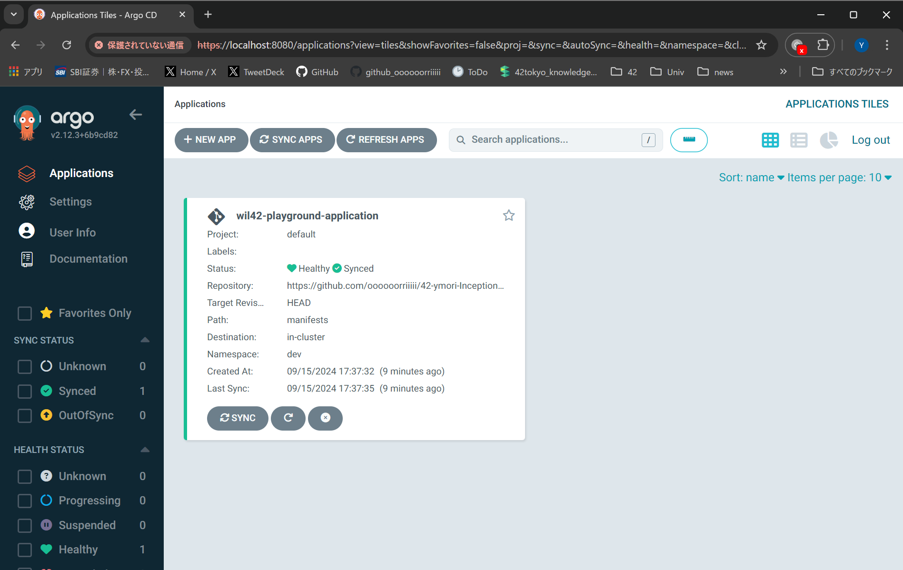
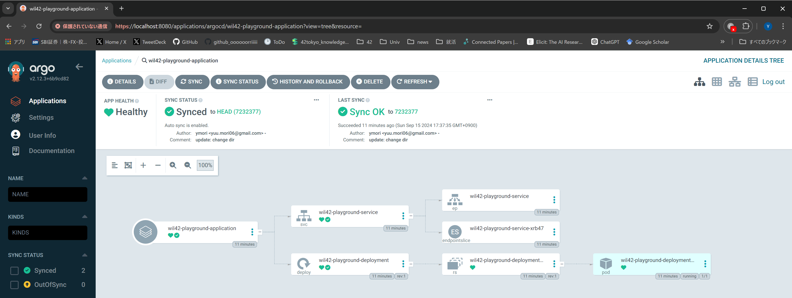
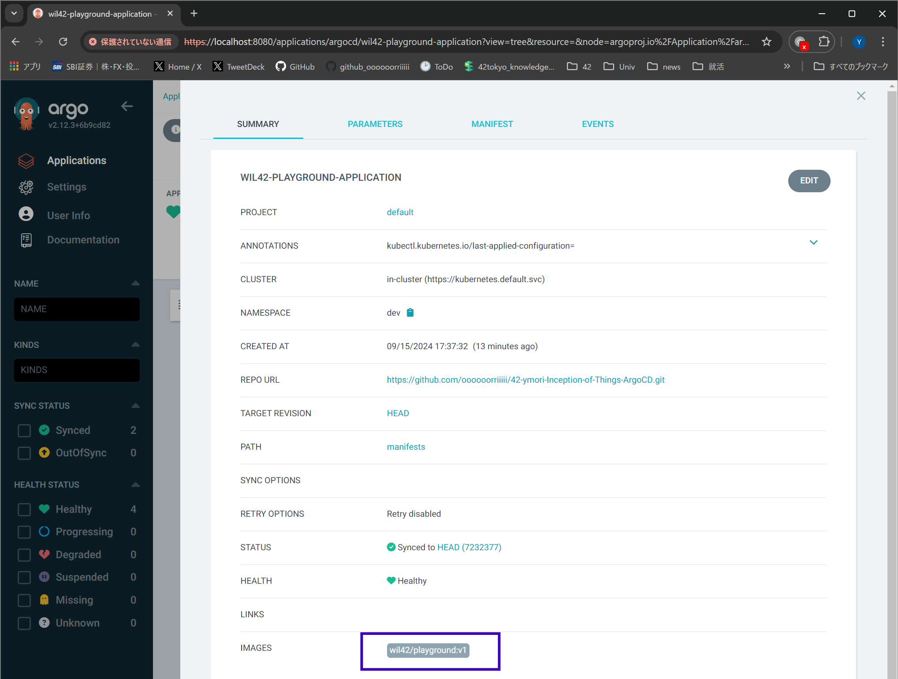
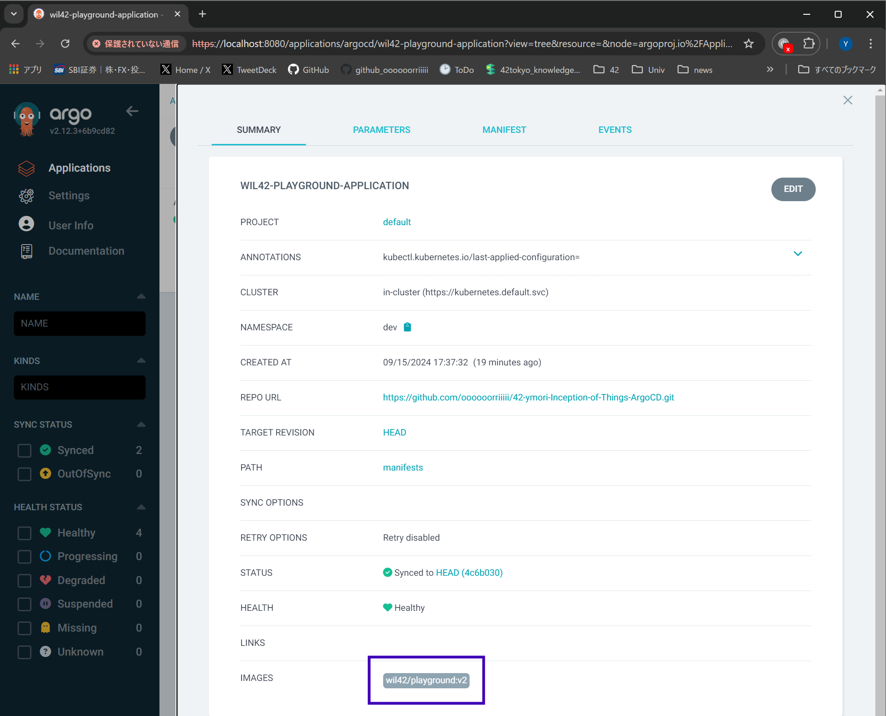

# Subject note

K3sとK3d、Vagrantの使い方を学ぶ課題。Ingressを使用したいので、kindではなくK3sを使用する。

## Part 1

### 要件

- 以下の要件を満たすvagrantfileを作成する
- Server
  - IP: `192.168.56.110`
  - K3sをcontroller modeでインストールする
- ServerWorker
  - IP: `192.168.56.111`
  - K3sをagent modeでインストールする
- パスワードなしでSSH接続できるようにする

### イメージ



### Vagrantfile

1. `vagrant init`でVagrantfileを作成する
2. 上記を要件を満たすようにVagrantfileを編集する
  - VMのイメージはLinux distribution の latest stable version であれば何でもよい
  - 2024/9時点では、Ubuntu 24.04 LTSが最新のLTSバージョンだが、Vagrant Cloudにイメージがないため、22.04 LTS（[`ubuntu/jammy64`](https://app.vagrantup.com/ubuntu/boxes/jammy64)）を使用することにした
3. `vagrant up`でVMを起動する
4. `vagrant ssh`でVMに接続する ← デフォルトでパスワードなしでSSH接続できる

#### Tips

- ネットワークインターフェースについて
  - subjectの記載では、`eth1`を使用するように指定されているが？
    - Linuxにおいてネットワークインターフェースの命名規則が変わったらしい
      - `eth0` -> `enp0s3` に相当
      - `eth1` -> `enp0s8` に相当
      - [CentOS 7のネットワーク名「enp1s0」という文字列の謎に迫る](https://qiita.com/fetaro/items/b61282130fa638de4528)
    - そのため、`enp0s8`でipアドレスが`192.168.56.110`, `192.168.56.111`になっていれば問題ない

### K3sのインストール

#### Server

- Vagrantfile内で実行するためのスクリプトを作成する
  - [Quick-Start Guide - K3S](https://docs.k3s.io/quick-start)
  - 基本的にはドキュメントに沿ってスクリプトを作成する
  - node ipを付与するために`--node-ip`だけ追加している
- Control Planeのトークンを取得する
  - このあとWorker node（k3sではagent）を追加していくときに、Master node（k3sではServer）のトークンが必要なため、トークンを取得しておく
  - `sudo cat /var/lib/rancher/k3s/server/token > /vagrant/token.env`
    - ちなみに、Vagrantはマウントの設定を明記しなくてもデフォルトでゲストVMの`/vagrant`ディレクトリをホストマシンのカレントディレクトリにマウントしてくれる。

#### ServerWorker

- Vagrantfile内で実行するためのスクリプトを作成する
  - agentとしてnodeを建てるため、`agent`オプション、Server nodeのIPアドレスとポート（`--server https://192.168.56.110:6443`）、保存しておいたServer nodeのトークン（`-t $(cat /vagrant/token.env)`）を指定する
  - node ipを付与するために`--node-ip`も追加する

#### Tips

- このあたりは、KubeadmでもMinikubeでもkindでもだいたい同じような操作となるため、一度経験しておくとその知識を使い回せてよい

### 確認

- Nodeが２つ立ち上がっていることを確認する
  - `kubectl get nodes`でnodeが２つ表示されていればよい
- HostのIPアドレスの確認
  - `ifconfig`で`enp0s8`のIPアドレスがそれぞれ`192.168.56.110`, `192.168.56.110`となっていればよい

## Part2

### 要件

- Virtual machine1つとserver modeでインストールされたK3sが必要
- K3sインスタンスで実行できるウェブアプリケーションを適当に３つ選ぶ
- Host
    - 192.168.56.110
    - name: ymoriS
- ホストが指定されたら、そのホストにアクセスできるようにする
- デフォルトはapp3
- 実行コマンド curl -H "Host:app2.com" 192.168.42.110

### イメージ


### 実装

イメージ図の通りにアプリケーションをデプロイするだけです。。。

#### 実装のポイント？

- `service`で`type`を指定しないと、`ClusterIP`になる。今回は`ClusterIP`で指定しておき、`Ingress`のバックエンドとして解決することで外部からアクセスできるようにする。

## Part3

- VagrantではなくDocker(k3d)を使用する
  - （kindとだいたい同じようなもの）
使用するPackageなどをインストールするためのスクリプトを作成しておくとよい。
- 以下の２つのnamespaceを作成する
  - `argocd`
  - `dev`
    - アプリケーションを格納しておくもの
    - Argo CDによって自動的にデプロイされる
    - 自分のGitHubリポジトリを使用する
      - Configuration fileを自分のリポジトリにpushしておく
      - メンバーのlogin名をリポジトリの名前に入れ込んでおいてください
    - taggingによって２つのバージョンを管理できるようにしておく

### イメージ



### k3dのインストール

- ドキュメントに沿ってk3dをインストールする
  - [k3d - Installation](https://k3d.io/v5.7.4/#installation)
- クラスタをデプロイする
  - `k3d cluster create <cluster-name>`
- クラスタのundeployは以下のコマンド
  - `k3d cluster delete <cluster-name>`

### Wil application。～GitOpsを添えずに～

#### v1のデプロイ

まず、GitOpsは考慮せずに、Wil prayground appをデプロイしてみる。

```application.yaml
apiVersion: apps/v1
kind: Deployment
metadata:
  name: wil42-playground-deployment
  namespace: dev
  labels:
    app: wil42-playground
spec:
  replicas: 1
  selector:
    matchLabels:
      app: wil42-playground
  template:
    metadata:
      labels:
        app: wil42-playground
    spec:
      containers:
      - name: wil42-playground
        image: wil42/playground:v1
        ports:
        - containerPort: 8888
---
apiVersion: v1
kind: Service
metadata:
  name: wil42-playground-service
  namespace: dev
spec:
  selector:
    app: wil42-playground
  ports:
  - protocol: TCP
    port: 8888
    targetPort: 8888
  type: LoadBalancer
```

デプロイする。

```bash
kubectl create namespace dev # dev namespaceを作成
kubectl apply -f application.yaml # アプリケーションをデプロイ
```

クラスタ外からアクセスするためにサービスをポートフォワードする。

```bash
kubectl port-forward svc/wil42-playground-service -n dev 8888:8888 # サービスをポートフォワード
```

curlで確認。

```bash
curl 127.0.0.1:8888

# 以下のようなレスポンスが返ってくればOK
{"status":"ok", "message": "v1"}
```

#### v2への変更

次に、`image: wil42/playground:v2`に変更してデプロイする。
上のapplication.yamlを以下のように変更する。

```application.yaml
[...]
    spec:
      containers:
      - name: wil42-playground
        image: wil42/playground:v2 # v2に変更
[...]
```

```bash
kubectl apply -f application.yaml # アプリケーションを更新
```

curlで確認。

```bash
curl 127.0.0.1:8888

# 以下のようなレスポンスが返ってくればOK。v2に変わっている。
{"status":"ok", "message": "v2"}
```

### wil application。～GitOpsを添えて～

上のアプリケーションの更新をGitOpsで行うことが、Part3の学習の目的である。

`~GitOpsを添えずに~`で行なった、「`application.yaml`の変更 -> `kubectl apply -f application.yaml`」の処理を、「変更した`application.yaml`をGitHubにpush -> Argo CDが自動的にデプロイ」として処理することがGitOpsである。

#### GitHubにマニュフェストをpushする

`application.yaml`をPushするためのリポジトリを作成する。このリポジトリには`image: wil42/playground:v1`のマニフェストをPushしておく。

- https://github.com/oooooorriiiii/42-ymori-Inception-of-Things-ArgoCD


#### Argo CDのインストールとデプロイ

Argo CDをインストールする。
基本的には、Argo CDのドキュメントに沿ってインストールすればよい。

- [Getting Started - Argo CD](https://argo-cd.readthedocs.io/en/stable/getting_started/)
  - 2. Download Argo CD CLI
    - 以下のページから適した方法でインストールする
      - [Installation - Argo CD](https://argo-cd.readthedocs.io/en/stable/cli_installation/)
  - 3. Access The Argo CD API Server
    - Port forwardingがいちばん簡単
    - 以下のコマンドを実行して、Argo CDのUIにアクセスする
      ```bash
      kubectl port-forward svc/argocd-server -n argocd 8080:443
      ```
    - ブラウザで`http://localhost:8080`にアクセスする（デフォルトで127.0.0.1:8080）
    - ログイン情報は以下の通り
      - username: admin
      - password: `argocd admin initial-password -n argocd`で取得する

#### デプロイマニュフェストを同期設定するためのApplicationリソースを作成

- `confs/application.yaml`を作成する
- デプロイする
  - ```bash
    kubectl apply -f confs/application.yaml
    ```
デプロイできた。





`wil42/playground:v1`のマニフェストがデプロイされていることが確認できる。



#### v2への変更

Wil42 Appのマニュフェストを配置しているリポジトリで、wil42/playground:v2に変更したマニフェストをPushする。

```bash
$ sed -i 's/wil42\/playground\:v1/wil42\/playground\:v2/g' application.yaml`
$ git diff
diff --git a/manifests/application.yaml b/manifests/application.yaml
index 594583e..9b78858 100644
--- a/manifests/application.yaml
+++ b/manifests/application.yaml
@@ -17,7 +17,7 @@ spec:
     spec:
       containers:
       - name: wil42-playground
-        image: wil42/playground:v1
+        image: wil42/playground:v2
         ports:
         - containerPort: 8888
 ---
$ git add .
$ git commit -m "v2"
[...]
To github.com:oooooorriiiii/42-ymori-Inception-of-Things-ArgoCD.git
   7232377..4c6b030  master -> master
```

Argo CDのUIを確認すると、v2に変更されていることが確認できる。



### シェルスクリプトに落とし込む

今までやった設定をシェルスクリプトに落とし込む。

1. Docker, kubectl, k3dのインストール
   - `setup-k3d-cluster-x86-64.sh`参照
   - Dockerのインストールでdockerをsudoなしで実行するために、再起動が必要。または`newgrp docker`でグループを再読み込みする。
     - [Linux post-installation steps for Docker Engine](https://docs.docker.com/engine/install/linux-postinstall/)
2. k3dクラスタの作成
   - `create-k3d-cluster.sh`参照
3. Argo CDのインストールとデプロイ
   - `deploy-argocd.sh`参照
   - ローカルでもVMでもArgo CDのサイトにアクセスできるように`0.0.0.0:8080`でポートフォワードしている。ローカルでデプロイしているときは`http://localhost:8080`でアクセスできる。VMでデプロイしているときは`http://<VMのIPアドレス>:8080`でアクセスできる。あまり良い方法ではないが、設定は全部スクリプトに落とせと言われているので。。。

## Bonus

### GitLabのインストール

GitLabの公式のサイトを参考にインストールする。

- [Deploy the GitLab Helm chart](https://docs.gitlab.com/charts/installation/deployment.html#deploy-using-helm)

```bash
kubectl port-forward svc/argocd-server -n argocd 8080:8080 --address 127.0.0.1
```

#### traefikの削除

k3dのデフォルトのIngress Controllerはtraefikであるが、GitLabのインストール時にはNGINX Ingress Controllerが必要となるため、traefikを削除する。
traefikを削除しないと、k3dで標準搭載されている`traefik`と`gitlab-nginx-ingress-controller`のポートが競合してしまう。

※GitLab側でtraefikを利用したり、nginx-ingress-controllerのポートを変更したりできそうだが、情報が少ないため、今回はNGINX Ingress Controllerを利用する。
参考) [Using Traefik](https://docs.gitlab.com/charts/charts/traefik/#fips-compliant-traefik)

```bash
kubectl delete svc traefik -n kube-system
```

- `--set global.hosts.https=false`を設定することで、HTTPSを無効にする
  - 今回の課題ではTLS証明書の設定を省いている
  - これを設定しないと、サインイン後に`https`にリダイレクトされるため、`422: The change you requested was rejected.`のエラーとなる
  - [Configure charts using globals](https://docs.gitlab.com/charts/charts/globals.html)

```bash
k3d cluster create <cluster-name>

## Argo CDのインストール
## https://argo-cd.readthedocs.io/en/stable/
kubectl create namespace argocd
kubectl apply -n argocd -f https://raw.githubusercontent.com/argoproj/argo-cd/stable/manifests/install.yaml
```

#### GitLabへのアクセス

以下コマンドでパスワードを取得する。

```bash
kubectl get secret gitlab-gitlab-initial-root-password -n gitlab -o jsonpath="{.data.password}" | base64 --decode
```

- ログイン情報
  - `http://gitlab.ymori.jp:8880`
  - username: `root`
  - password: 上記で取得したパスワード

※ /etc/hosts に `github.ymori.jp` を追加しておく

#### GitLab上でリポジトリを作成する

`git clone http://gitlab.ymori.jp:8880/<username>/<repository>.git`でリポジトリをクローンする。ログイン情報はログインしたときと同じもの。

| 項目 | 設定値 |
|--|--|
| Project name | `42iot` |
| Project URL | `http://gitlab.ymori.jp:8880/root/42iot.git` |
| Visibility Level | `Public` |

※コマンドラインへのペーストは右クリックでできる。

#### GitLabリポジトリのデプロイトークンを作成する

1. ［Settings］→［Repository］を選択。
2. ［Deploy tokens］の［Expand］をクリック。
3.  [add token]をクリックして、デプロイトークンを作成する。

| 項目 | 設定値 |
| --- | --- |
| Name | `argocd` |
| Expiration data | なし |
| Username | `argocd` |
| Scope | `read_repository` |

トークンをコピーしておく.

#### Secretリソースを作成する

1. applocation.yamlの以下を作成したGitLabリポジトリのURLに変更する。

```yaml
stringData:
  repoURL: http://gitlab.ymori.jp:8880/root/42iot.git
```

2. confs/secret.yamlの`password`に上記で作成したデプロイトークンを設定する。
3. SecretリソースをKubernetesに適用する。

```bash
kubectl apply -f confs/secret.yaml
```

### Argo CD

#### Argo CDにアクセスする

0. Argo CDのUIにアクセスするためにポートフォワードする。

```bash
kubectl port-forward svc/argocd-server -n argocd 8080:443 --address 127.0.0.1
```

1. 初期パスワード確認する。

```bash
argocd admin initial-password -n argocd
```

2. Argo CDアクセスする。

- ログイン情報
  - `http://localhost:8080`
  - username: `admin`
  - password: 上記で取得したパスワード

### デプロイマニュフェストを同期するためのApplicationリソースを作成

1. applocation.yamlの以下を作成したGitLabリポジトリのURLに変更する。

```yaml
    repoURL: http://gitlab.example.com:8880/root/42iot.git
```

2. デプロイする。

```bash
kubectl create namespace dev
kubectl apply -f confs/application.yaml
```

TODO: 以下エラーの解決

Failed to load target state: failed to generate manifest for source 1 of 1: rpc error: code = Unknown desc = Get "http://gitlab.example.com:8880/root/42iot.git/info/refs?service=git-upload-pack": dial tcp 127.0.0.1:8880: connect: connection refused

ingressを介しているので、gitlab.ymori.jp が 127.0.0.1 に解決されるとこわれる？

## Tips

### バージョンの確認

利用するすべてのプロジェクトのバージョンは最新のものにしておいたほうがよい。

バージョンの不一致で諸々の問題が発生することがあるため、バージョンを揃えておきましょう。

- kubernetesのバージョンは最新ですか？
  - `k3d --version`で確認
- dockerのバージョンは最新ですか？
  - `docker --version`で確認

### Windowsの`/etc/hosts`はどこにあるのか

名前解決をさせるためには、`/etc/hosts`に名前解決をさせるためのエントリを追加する必要がある。
Linuxでは`/etc/hosts`にエントリを追加するが、Windowsでは`C:\Windows\System32\drivers\etc\hosts`にエントリを追加する必要がある。
WLS上で`/etc/hosts`を編集してもWindows側の`C:\Windows\System32\drivers\etc\hosts`には反映されないので注意する。

PowerShellで`C:\Windows\System32\drivers\etc\hosts`を編集するためのコマンドは以下の通り。

```bash
 powershell -NoProfile -ExecutionPolicy unrestricted -Command "start notepad C:\Windows\System32\drivers\etc\hosts -verb runas"
```

### WindowsでVagrant実行するときの注意

- [VirtualBox で Failed to open/create the internal network 'HostInterfaceNetworking-VirtualBox Host-Only Ethernet Adapter' が出た時の対処](https://qiita.com/0xC0FFEE/items/ae80a7d767144c2e1992)
  - `インターネットプロトコルバージョン6(TCP/IPv6)` のチェックを外す

### TLS証明書

- [KubernetesのTLS証明書](https://qiita.com/nsawa/items/4f11ac89707aad2c3d4a)